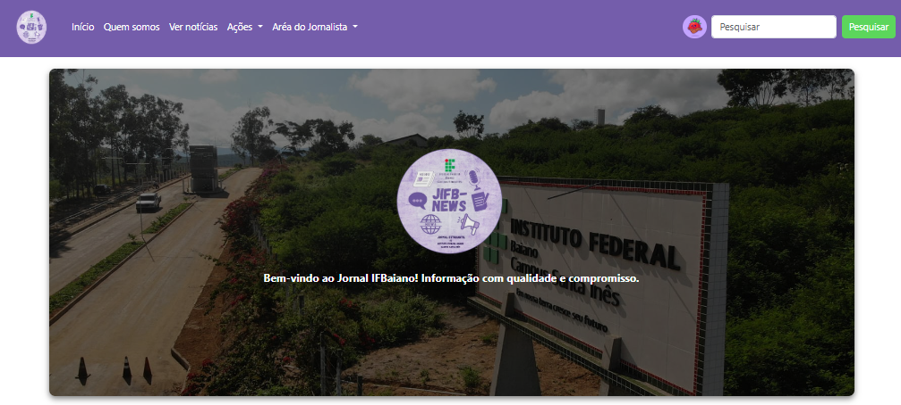

# Centro-Estudantil-SEBRAE

> O Centro-Estudantil-SEBRAE é um projeto consiste na criação de um site que funcionará como o jornal da escola. A proposta é centralizar todas as informações importantes da instituição em um único lugar

## 🤝 Contribuidor 

Agradecemos a seguinte pessoa que contribuiu para este projeto:

<table>
  <tr>
    <td align="center"> 
      <a href="https://github.com/Ghs-d" title="Front-End Developer"> 
      
        
       
        <b>
          Guilherme
        </b> 
       
    </a> 
    </td>
  </tr>
  <tr>
    <td align="center"> 
      <a href="https://github.com/lucasmystOS" title="Front-End Developer"> 
      
        
       
        <b>
          Lucas Vieira
        </b> 
       
    </a> 
    </td>
  </tr>
</table>
